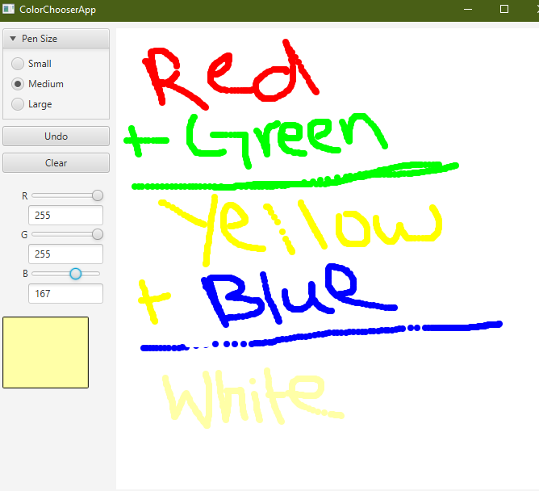

This is a modified version of the paint app which allows you to update TextField’s text when a Slider’s 
value changed, but not vice versa.
You have to add javafx-sdk which contains the libraries required to run this project and you have to also set the VM option 
according to your operating system.
You can download the javafx libray from https://gluonhq.com/products/javafx/ .
You can see how to setup intellij according to your operating system from https://openjfx.io/openjfx-docs/ .

ScreenShots:

