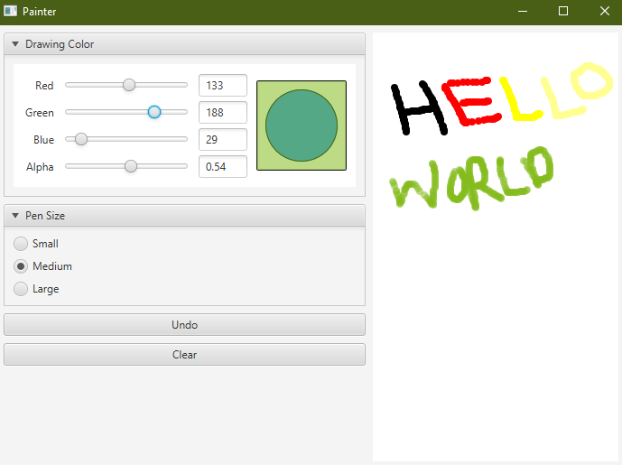
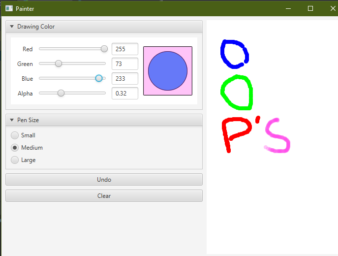

This is a basic paint app where you can drawthing using your mouse. You have option make your own colors using different combinations 
of red, green and blue colors. You can also set the thickness of the cursor.
You have to add javafx-sdk which contains the libraries required to run this project and you have to also set the VM option 
according to your operating system.
You can download the javafx libray from https://gluonhq.com/products/javafx/ .
You can see how to setup intellij according to your operating system from https://openjfx.io/openjfx-docs/ .

ScreenShots:

