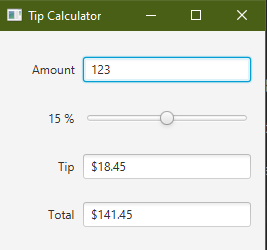
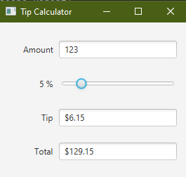
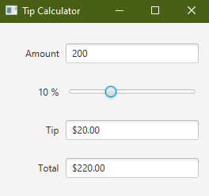
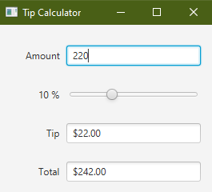

This is a tip calculator where you enter amount and the percentage of the tip. This it will automatically
calculate the tip without pressing and button.
You have to add javafx-sdk which contains the libraries required to run this project and you have to also set the VM option 
according to your operating system.
You can download the javafx libray from https://gluonhq.com/products/javafx/ .
You can see how to setup intellij according to your operating system from https://openjfx.io/openjfx-docs/ .

ScreenShots:

