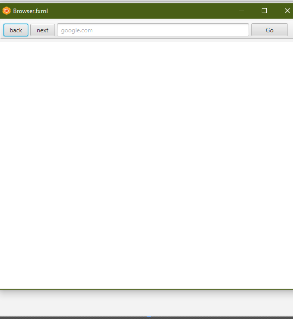

This is a mini web browser with simple features like back, next, searchbar, and with a go button.
PS: Add javafx-sdk to the libray of the project and set the VM accoding to your operating system.
You can download the javafx libray from https://gluonhq.com/products/javafx/.
You can see how to setup intellij according to your operating system from https://openjfx.io/openjfx-docs/

ScreenShots:

